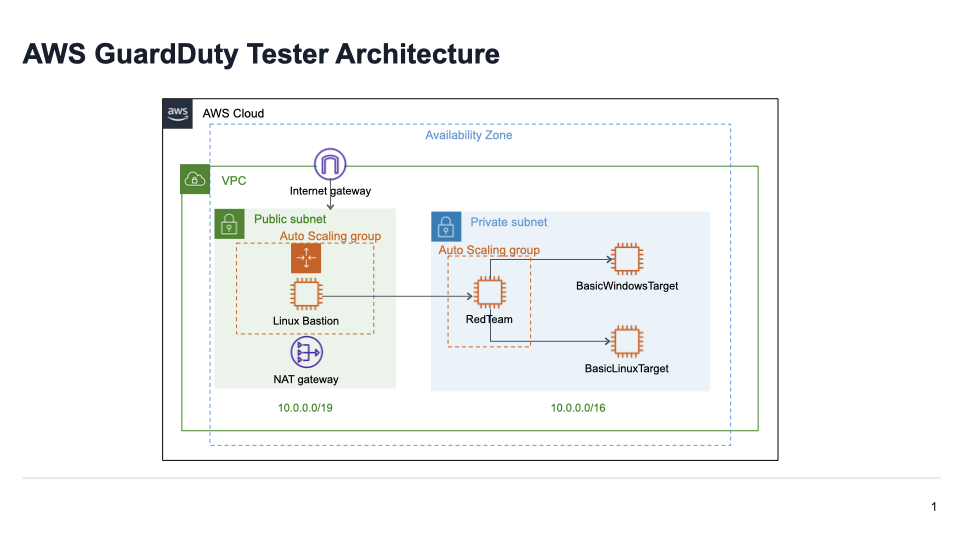

# Amazon GuardDuty Tester

This repository contains scripts and guidance that can be used as a proof-of-concept to generate Amazon GuardDuty findings related to real AWS resources.  There are multiple tests that can be run independently or together depending on the findings you are looking to generate.  These scripts do not generate examples for every possible GuardDuty finding type but do help provide insight that can help in understanding how to view and respond to GuardDuty findings for resources deployed in your environment.

It is recommended that these tests be deployed in a non-production account to ensure that findings generated by these tests can be clearly identified.  Additionally, the permissions to deploy these tests are quite broad and using a non-production account helps to ensure that these permissions are contained to an account where the impact of these permissions is reduced.  

The following tests are available in this repository:
1) [Findings related to EC2 instances and Malware protection](#generating-findings-related-to-ec2-instances-and-malware-protection)
2) [Findings related to EKS clusters on EC2 using Kubernetes Audit Logs and EKS Runtime protection](eks)


## Generating findings related to EC2 instances and Malware protection
 The [guardduty-tester-template.yaml](guardduty-tester-template.yaml) uses AWS CloudFormation to create an isolated environment with a bastion host, an ECS cluster running on an EC2 instance that you can ssh into, and two target EC2 instances. Then you can run [guardduty_tester.sh](guardduty_tester.sh) that starts interaction between the tester EC2 instance and the target Windows EC2 instance and the target Linux EC2 instance to simulate five types of common attacks that GuardDuty is built to detect and notify you about with generated findings. Additionally, the template stages sample EICAR [Eicar malware samples](https://www.eicar.org/download-anti-malware-testfile/) malware files, which contain strings that will be detected as malware.   These files are staged locally on the EC2 instance and in a container image deployed on the ECS cluster.  These files are intended to trigger GuardDuty malware findings to be created based on the EC2 findings that are created from running the guardduty_tester.sh script.  

 Once deployed the architecture for the testing resources will look like the below image.  Note: IP address ranges will vary for each deployment.
 

## Prerequisites

You must enable GuardDuty in the same account and region where you want to run the Amazon GuardDuty Tester script. For more information about enabling GuardDuty, see https://docs.aws.amazon.com/guardduty/latest/ug/guardduty_settingup.html#guardduty_enable-gd.

If you are looking to see findings for malware generated you need to enable the Malware Protection feature of GuardDuty.  

You must generate a new or use an existing EC2 key pair in each region where you want to run these scripts. This EC2 keypair is used as a parameter in the guardduty-tester-template.yaml template that you use in Step 1 to create a new CloudFormation stack. For more information about generating EC2 key pairs, see https://docs.aws.amazon.com/AWSEC2/latest/UserGuide/ec2-key-pairs.html.

### Permissions
An IAM Policy listing the minimal permissions for deploying and deleting the resources for this test, via CloudFormation, are located in the [gd-ec2-malware-iam-policy.json](gd-ec2-malware-iam-policy.json) file.


## Deployment steps
### Step 1

Create a new CloudFormation stack using guardduty-tester-template.yaml. For detailed directions about creating a stack, see https://docs.aws.amazon.com/AWSCloudFormation/latest/UserGuide/cfn-console-create-stack.html.

Before you run guardduty-tester-template.yaml , modify it with values for the following parameters: Stack Name to identify your new stack, Availability Zone where you want to run the stack, and Key Pair that you can use to launch the EC2 instances. Then you can use the corresponding private key to SSH into the EC2 instances.

[guardduty-tester-template.yaml](guardduty-tester-template.yaml) takes around 10 minutes to run and complete. It creates your environment and copies guardduty_tester.sh onto your tester EC2 instance.

### Step 2

Click the checkbox next to your running CloudFormation stack created in the step above. In the displayed set of tabs, select the Output tab. Copy the IP address assigned to the bastion host.

Navigate to the EC2 console and locate the EC2 instance running with the name of "RedTeam".  Copy the private IP address of the instance.   

You will need the bastion host and RedTeam EC2 instance IP addresses in order to ssh into the tester EC2 instance.

Create the following entry in your **~/.ssh/config** file to login to your instance through the bastion host and add the appropriate values for the items enclosed by <>:
```
Host bastion
	HostName <Elastic IP Address of Bastion>
	User ec2-user
	IdentityFile ~/.ssh/<your-ssh-key.pem>
Host tester
	ForwardAgent yes
	HostName <Local IP Address of RedTeam Instance>
	User ec2-user
	IdentityFile ~/.ssh/<your-ssh-key.pem>
	ProxyCommand ssh -W %h:%p bastion
	ServerAliveInterval 240
```

Once this configuration is in place use the following command to connect to the tester instance:
```
$ ssh tester
```

For more details on configuring and connecting through bastion hosts you can read this article:
https://aws.amazon.com/blogs/security/securely-connect-to-linux-instances-running-in-a-private-amazon-vpc/


## Step 3

Once connected to the tester instance run the following command to initiate interactions between your tester instance and target EC2 instances, simulate attacks, and generate GuardDuty Findings:
```
$ ./guardduty_tester.sh
```

#### Generated GuardDuty findings
Below is a list of the GuardDuty finding types that are expected to be generated as a result of running the guardduty_tester.sh script.  These findings will show at different times within the GuardDuty console. The PortScan, SSHBruteForce, and MaliciousFile findings will show in approximately 15 minutes after the guarddduty_tester script finishes.   The remaining DNS findings will show approximately 30-60 minutes after running the guardduty_tester script.  

* Recon:EC2/Portscan
* UnauthorizedAccess:EC2/SSHBruteForce
* CryptoCurrency:EC2/BitcoinTool.B!DNS
* Trojan:EC2/DNSDataExfiltration
* Backdoor:EC2/C&CActivity.B!DNS
* Execution:EC2/MaliciousFile
* Execution:ECS/MaliciousFile


## Deployment troubleshooting
* **Bastion or ECS AutoScaling resources are failing to launch via CloudFormation template**

The bastion and ECS resources for this tester are deployed via AutoScaling.  When these resources fail to launch the most common failure is that EC2 is configured to encrypt all EBS volumes with a KMS key but the AutoScaling service has not been granted access to using the key.  To address this issue see the following public documentation: https://docs.aws.amazon.com/autoscaling/ec2/userguide/key-policy-requirements-EBS-encryption.html


## Clean up test resources
When done testing use the following steps to clean up the resources created by the above deployment steps.

### Delete CloudFormation stack
In CloudFormation locate the stack that was created in deployment step 1.  Delete this stack and confirm that all resources and the stack are successfully deleted.


## License

This library is licensed under the Apache 2.0 License. 
