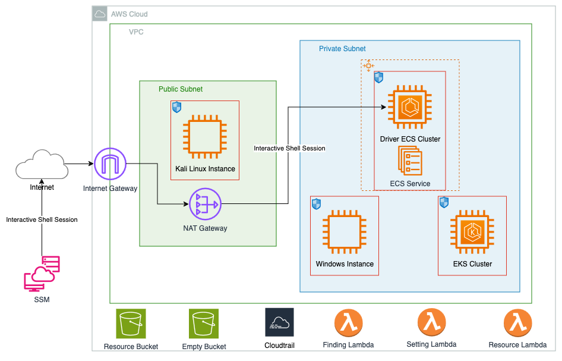

# GuardDuty Findings Tester

This repository contains scripts and guidance that can be used as a proof-of-concept to generate Amazon GuardDuty findings related to real AWS resources. There are multiple tests that can be run independently or together depending on the findings you are looking to generate. These scripts do not generate examples for every possible GuardDuty finding type but do help provide insight that can help in understanding how to view and respond to GuardDuty findings for resources deployed in your environment.

It is recommended that these tests be deployed in a non-production account to ensure that findings generated by these tests can be clearly identified. Additionally, the permissions to deploy these tests are quite broad and using a non-production account helps to ensure that these permissions are contained to an account where the impact of these permissions is reduced.

## Deploy Testing Environment

### Pre-requisites
- git
- awscli
- Session Manager Plugin [installation instructions](https://docs.aws.amazon.com/systems-manager/latest/userguide/session-manager-working-with-install-plugin.html)
- npm
- Docker
- Subscription to [Kali Linux Image](https://aws.amazon.com/marketplace/pp/prodview-fznsw3f7mq7to)

### Deploy

AWS credentials staged which have enough permissions for deploying all the resources listed in this solution are required to deploy the testing environment. Running `cdk deploy` from the amazon-guardduty-tester directory will build the tester resources (see below) in the aws cli default account and region unless the account region variables are manually set in the `bin/cdk-gd-tester.ts` file. Use either approach to define where to deploy the tester.

- `git clone https://github.com/awslabs/amazon-guardduty-tester && cd amazon-guardduty-tester`
- `npm install`
- `cdk bootstrap #if region not bootstrapped previously`
- `cdk deploy`



## Run Tests

### Start Session with Test Driver

After the deployment of resources is complete save the region to which you deployed as variables in your terminal:
```
$ REGION=<region-here>
```

The tester is only accessible through AWS System Manager (SSM) an operations hub for AWS applications and resources, providing a secure end-to-end management solution. To start an interactive shell on the tester host instance, query the instance id of the host and set it as the 'target' of the session and set the entrance path and command. 

Run the following command to begin your session with the tester:
```
aws ssm start-session \
  --region $REGION \
  --document-name AWS-StartInteractiveCommand \
  --parameters command="cd /home/ssm-user/py_tester && bash -l" \
  --target $(aws ec2 describe-instances \
    --region $REGION \
    --filters "Name=tag:Name,Values=Driver-GuardDutyTester" \
    --query "Reservations[].Instances[?State.Name=='running'].InstanceId" \
    --output text)
```

### Generate Findings
The tester is a python based program that dynamically builds a bash script to generate findings based on user input. You have many options to generate findings based on resource, tactic, GuardDuty feature, log source, and even as granular as one or more specific finding type.
`python3 guardduty_tester.py --help` output gives usage. 

```
EXAMPLES:
  python3 guardduty_tester.py
  python3 guardduty_tester.py --all
  python3 guardduty_tester.py --s3
  python3 guardduty_tester.py --tactics discovery
  python3 guardduty_tester.py --ec2 --eks --tactics backdoor policy execution
  python3 guardduty_tester.py --eks --runtime only
  python3 guardduty_tester.py --ec2 --runtime only --tactics impact
  python3 guardduty_tester.py --log-source dns vpc-flowlogs
  python3 guardduty_tester.py --finding 'CryptoCurrency:EC2/BitcoinTool.B!DNS'
```

### Important Callout
GuardDuty has many features that can be enabled/disabled on an account level such as EKS/ECS/EC2 Runtime Monitoring, Lambda protection, etc. The tester will check these and other account level settings required for the tests requested by the given parameters. Before any account level change is made, the tester will request user permission and after the tests are completed, the account will be restored to its original state. It is important to note that any changes to GuardDuty protections may begin the 30 day free trial.

## Cleanup Test Resources
When finished testing, run `cdk destroy` or delete the CloudFormation stack on the console in order to delete the resources created by the above deployment steps

## Troubleshooting
Common issues:
- `Cloud assembly schema version mismatch` ->  update the AWS CDK CLI to a compatible version. For more info see https://docs.aws.amazon.com/cdk/v2/guide/versioning.html#cdk_toolkit_versioning
- `Docker permission denied` -> Add the current user to the docker group to be able to run in rootless mode
- Deployment can fails due to Availability Zone incompatibility, if you encounter this error see [this post](https://repost.aws/knowledge-center/ec2-instance-type-not-supported-az-error) from knowledge AWS share, and either choose a new region or hardcode the region/AZ you wish to deploy in. For region edit the `bin/cdk-gd-tester.ts` file to reflect your desired region and for AZ edit the `lib/common/network/vpc.ts` file and replace `maxAzs: 2,` with `availabilityZones: ['<Your-AZ-Here>', '<Your-Other-AZ>' ... ],`

## Findings Tester Can Generate
Runtime findings are applicable to EC2, ECS, and EKS workloads provided the GuardDuty security agent is installed and operating properly. However some container findings such as `PrivilegeEscalation:Runtime/RuncContainerEscape` are for containers only and as such are only ECS and EKS applicable. Malware findings are also expected to be generated (depending on tests run), but no manual scanning capabilities have been included in the tester at this time because such scans are not free tier eligible.
```
- Backdoor:EC2/C&CActivity.B!DNS
- Backdoor:EC2/DenialOfService.DNS
- Backdoor:EC2/DenialOfService.UDP
- Backdoor:Runtime/C&CActivity.B!DNS
- CryptoCurrency:EC2/BitcoinTool.B!DNS
- CryptoCurrency:Runtime/BitcoinTool.B!DNS
- DefenseEvasion:Runtime/ProcessInjection.Ptrace
- DefenseEvasion:Runtime/ProcessInjection.VirtualMemoryWrite
- Discovery:Kubernetes/MaliciousIPCaller.Custom
- Discovery:Kubernetes/SuccessfulAnonymousAccess
- Discovery:Kubernetes/TorIPCaller
- Discovery:Runtime/RawSocketCreated
- Discovery:S3/MaliciousIPCaller.Custom
- Discovery:S3/TorIPCaller
- Execution:Kubernetes/ExecInKubeSystemPod
- Execution:Runtime/MemoryMarkedExecutable
- Execution:Runtime/ReverseShell
- Impact:EC2/AbusedDomainRequest.Reputation
- Impact:EC2/BitcoinDomainRequest.Reputation
- Impact:EC2/MaliciousDomainRequest.Reputation
- Impact:EC2/SuspiciousDomainRequest.Reputation
- Impact:Kubernetes/MaliciousIPCaller.Custom
- Impact:Runtime/AbusedDomainRequest.Reputation
- Impact:Runtime/BitcoinDomainRequest.Reputation
- Impact:Runtime/MaliciousDomainRequest.Reputation
- Impact:Runtime/SuspiciousDomainRequest.Reputation
- PenTest:IAMUser/KaliLinux
- PenTest:S3/KaliLinux
- Persistence:Kubernetes/ContainerWithSensitiveMount
- Policy:Kubernetes/AdminAccessToDefaultServiceAccount
- Policy:Kubernetes/AnonymousAccessGranted
- Policy:S3/AccountBlockPublicAccessDisabled
- Policy:S3/BucketAnonymousAccessGranted
- Policy:S3/BucketBlockPublicAccessDisabled
- Policy:S3/BucketPublicAccessGranted
- PrivilegeEscalation:Kubernetes/PrivilegedContainer
- PrivilegeEscalation:Runtime/ContainerMountsHostDirectory
- PrivilegeEscalation:Runtime/DockerSocketAccessed
- Recon:EC2/Portscan
- Recon:IAMUser/MaliciousIPCaller.Custom
- Recon:IAMUser/TorIPCaller
- Stealth:IAMUser/CloudTrailLoggingDisabled
- Stealth:IAMUser/PasswordPolicyChange
- Stealth:S3/ServerAccessLoggingDisabled
- Trojan:EC2/BlackholeTraffic!DNS
- Trojan:EC2/DGADomainRequest.C!DNS
- Trojan:EC2/DNSDataExfiltration
- Trojan:EC2/DriveBySourceTraffic!DNS
- Trojan:EC2/DropPoint!DNS
- Trojan:EC2/PhishingDomainRequest!DNS
- Trojan:Runtime/BlackholeTraffic!DNS
- Trojan:Runtime/DGADomainRequest.C!DNS
- Trojan:Runtime/DriveBySourceTraffic!DNS
- Trojan:Runtime/DropPoint!DNS
- Trojan:Runtime/PhishingDomainRequest!DNS
- UnauthorizedAccess:EC2/MaliciousIPCaller.Custom
- UnauthorizedAccess:EC2/RDPBruteForce
- UnauthorizedAccess:EC2/SSHBruteForce
- UnauthorizedAccess:IAMUser/InstanceCredentialExfiltration.OutsideAWS
- UnauthorizedAccess:IAMUser/MaliciousIPCaller.Custom
- UnauthorizedAccess:IAMUser/TorIPCaller
- UnauthorizedAccess:Lambda/MaliciousIPCaller.Custom
- UnauthorizedAccess:Runtime/MaliciousIPCaller.Custom
- UnauthorizedAccess:S3/MaliciousIPCaller.Custom
- UnauthorizedAccess:S3/TorIPCaller
```